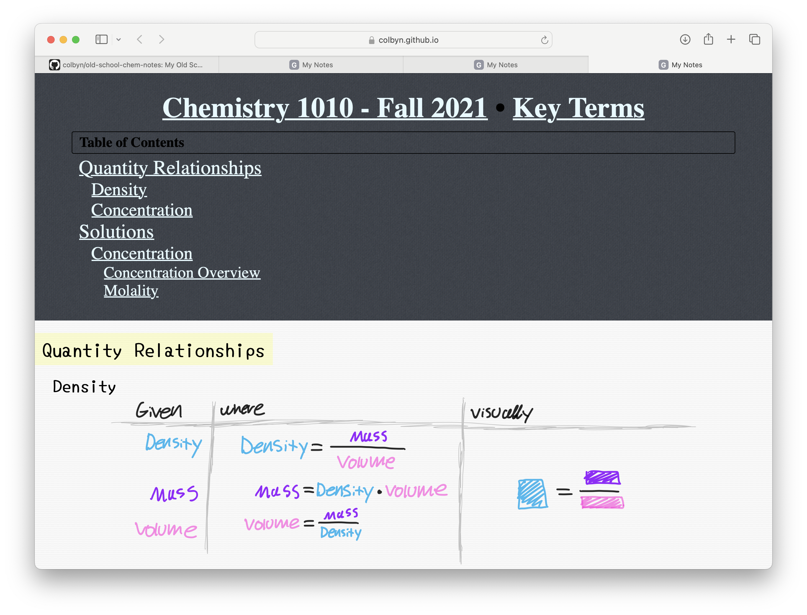
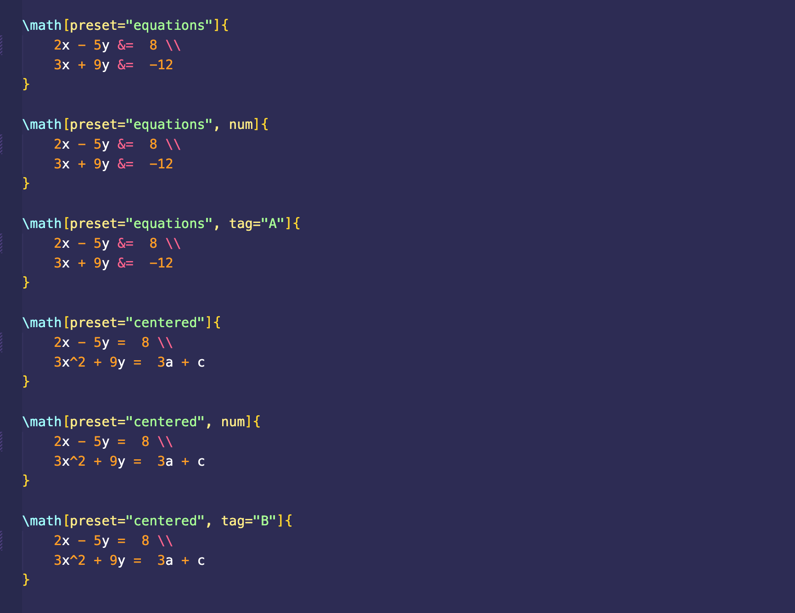
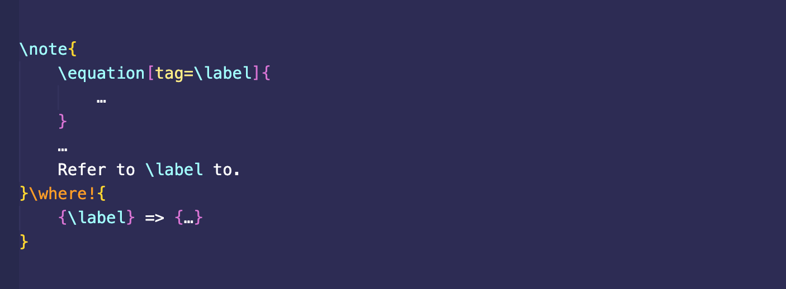
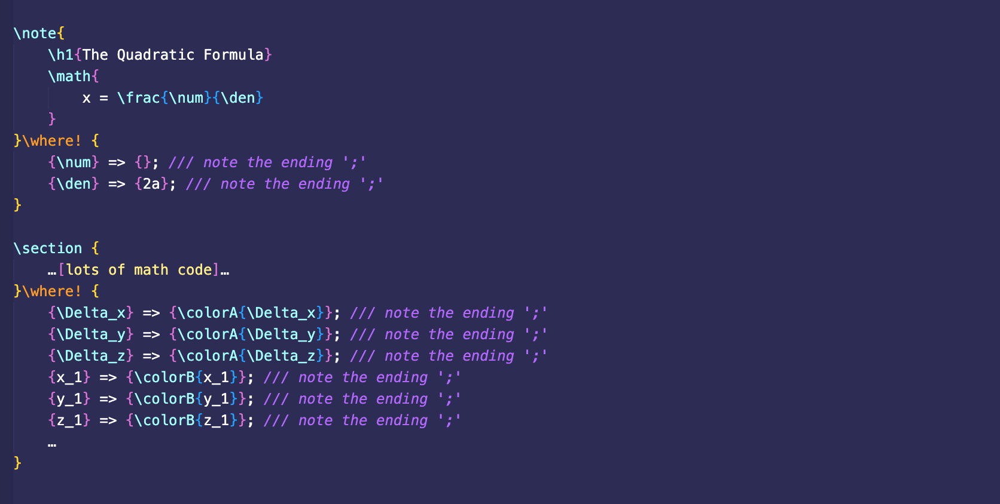

# 2018

## [SubSys/Compiler](https://github.com/SubSys/Compiler)

An Elm to Rust compiler implemented in Haskell. 

## [colbyn/commands](https://github.com/colbyn/commands)

**A convenient tool for building upon and referencing existing cli tools via a bash dialect.**

Overall, just some simple and convenience tool, where something like make isn’t required.


### This tool has some pretty cool ideas

**Indentation sensitive parser:**
```
aws cloudformation deploy
    --template-file $(pwd)/aws-infrastructure.yaml
    --stack-name ...
    --s3-bucket ...
    --capabilities CAPABILITY_IAM CAPABILITY_NAMED_IAM
```

**Functions:**
```
from ./backend/services do
  stack build
  stack exec provision-db
```

**Multiline Strings:**
```
psql -d services -tc
  """
  CREATE EXTENSION IF NOT EXISTS "uuid-ossp"
  """
```

**A perfect example featuring the aws cli (i.e. because tool is incredibly VERBOSE):**
```
# AWS Helpers

command aws::deploy do
  aws cloudformation deploy
    --template-file $(pwd)/aws-infrastructure.yaml
    --stack-name ...
    --s3-bucket ...
    --capabilities CAPABILITY_IAM CAPABILITY_NAMED_IAM

command aws::deploy::info do
  aws cloudformation deploy
    --template-file $(pwd)/aws-infrastructure.yaml
    --stack-name ...
    --s3-bucket ...
    --no-execute-changeset
    --capabilities CAPABILITY_IAM CAPABILITY_NAMED_IAM

# Build and upload our image.
command ami::build do
  linuxkit build -format vmdk -dir .linuxkit-out ./aws-image.yaml
  ami-uploader .linuxkit-out/aws-image.vmdk
```

> Notice that this is basically bash + misc. conveniences like an indentation sensitive parser.

**Other examples:**
```
# idk...
command publish do
  echo "Publishing..."
  silent do
    git add .
    git commit -m "auto"
    git push -u origin master
    echo "complete"
  echo "Complete."
  git --no-pager log --name-status HEAD^..HEAD | grep commit

command db::init do
  # Since Postgres doesn’t support something like “CREATE DATABASE IF NOT EXISTS”,
  # well just run the following command and discard the the error it will produce
  # if already created via the `try do <code block>` function.
  try do
    createdb services

  psql -d services -tc
    """
    CREATE EXTENSION IF NOT EXISTS "uuid-ossp"
    """

  from ./backend/services do
    stack build
    stack exec provision-db
  echo "Setup complete."

command run-chrome do
  # Usually commands ending with an ‘_’ will redirect stdout/stderr to `/dev/null`.
  run_ "/Applications/Google Chrome.app/Contents/MacOS/Google Chrome"
      --app=http://127.0.0.1:3000
      --auto-open-devtools-for-tabs

command test do
  # should this be something like `let lorem = ...`?
  lorem <- echo "lorem ipsum"
  parallel do
    echo "first"
    echo "second"
    silent echo "third"
  echo "done"
```


# 2019

**According to GitHub in 2019 I made 1,323 contributions.**

> To put this in perspective: according to this [data source](https://web.archive.org/web/20200415010317/https://gist.github.com/paulmillr/2657075/), from from December 2016 to December 2017, the 256th person (at the end of the list) made 1,322 total contributions. **So I literally beat the 256th person by a single contribution.** 

## Major Projects

### [Imager Project]( https://github.com/imager-io )

Automated image compression for efficiently distributing images on the web.

**See my Medium article:**
- [Modern Image Optimization for 2020- Issues, Solutions, and Open Source solutions](https://medium.com/@colbyn/modern-image-optimization-for-2020-issues-solutions-and-open-source-solutions-543af00e3e51)

Notably includes a tool called [imager]( https://github.com/imager-io/imager ) for optimizing the binary encoding of images in a brute force trial ’n error sorta manner, using a new (at that time) ML based perceptual quality metric designed to be a more accurate model of human perception compared to prior formulaic approaches.

It is extremely good at what it does.

[Compression Benchmarks](https://github.com/colbyn/imager-bench-2019-11-2):
```
source        : ▇▇▇▇▇▇▇▇▇▇▇▇▇▇▇▇▇▇▇▇▇▇▇▇▇▇▇▇▇▇▇▇▇▇▇▇▇▇▇ 39.00M (4 images)
kraken.io     : ▇▇▇▇▇▇▇▇▇▇▇▇▇▇▇▇▇▇▇▇▇▇▇▇ 24M
jpegmini.com  : ▇▇▇▇▇▇▇▇▇▇▇▇▇▇▇▇ 16M
compression.ai: ▇▇▇▇▇▇▇▇ 8.90M
imager        : ▇▇▇▇ 4.20M
```

#### Sub Projects

- [imager-io/imager-io-js]( https://github.com/imager-io/imager-io-js ): Imager for JavaScript (NodeJS) - Site performance tools for efficiently distributing media on the web. This project demonstrates my ability to call rust code from the NodeJS runtime. 
- [imager-io/webp-dev-rs](https://github.com/imager-io/webp-dev-rs): Rust bindings to libwebp, libwebpdemux, and workarounds for static/inline C functions and some other miscellaneous stuff.
- [imager-io/ffmpeg-dev-rs](https://github.com/imager-io/ffmpeg-dev-rs): Rust - Self Contained FFmpeg Bindings. Not recommend for beginners. This library isn’t safe nor idiomatic rust, a consequence offering direct bindings to the FFmpeg C APIs. This was a very difficult to get working.
- [imager-io/x264-dev]( https://github.com/imager-io/x264-dev ): Self contained rust binding to libx264. I.e. no system and network dependencies. Painstakingly transferred doc comments from the C header files to the rust API.
- [colbyn/vmaf-sys](https://github.com/colbyn/vmaf-sys): Rust VMAF FFI.
  
  **VMAF:** VMAF is an Emmy-winning perceptual video quality assessment algorithm developed by Netflix. 


### [colbyn/web-images-js]( https://github.com/colbyn/web-images-js )

Safe - Fast (and Non Blocking) - Dependency free - MIT License (with no GPL extras) - Image Loading, Resizing, Conversion and Processing.

- No annoying system requirements on libvips, ImageMagic and etcetera. There are rust dependencies yet everything is baked into the release binary and requires no further dependencies.

- Bugs are inevitable and furthermore what bridges the JS world with the rust implementation is the low-level NAPI interface. Yet while the picture isn’t perfect, the FFI boundary is rather small in comparison. If you buy into Rust and it’s semantics, this should *at the very least* be a step in the right direction.


# 2020

**My Note Taking Explorations.**

- The tools I developed to compile and publish my school notes such as,
    - [The HTML Toolchain]( https://github.com/subscript-publishing/subscript-html ) 
- Also the notes themselves:
    - [colbyn's math notes]( https://colbyn.github.io/school-notes-spring-2020/ ).
        - Which I used to great effect and yet such left much to be desired, especially for hand drawn notes (see the following chem notes).
    - My proof-of-concept chemistry notes:
        - [root index]( https://colbyn.github.io/old-school-chem-notes/dev/chemistry-1010---fall-2021/index.html )
        - Where this differs from other note taking apps is its ability to support giant autogenerated **tables of contents** from the root notebook down to the individual pages.
        - [example page]( https://colbyn.github.io/old-school-chem-notes/dev/chemistry-1010---fall-2021/overview.html ).
- Overall I wanted notes that were as compact as possible for any viewport resolution, and that could be navigated as quickly as possible in an obvious way.
- **The code for all my note taking explorations culminated into the mono repo over at [subscript-publishing/subscript](https://github.com/subscript-publishing/subscript)**


## [Colbyn's Math Notes]( https://colbyn.github.io/school-notes-spring-2020/ )
 
My beautiful math notes!


## [My Chemistry Notes](https://colbyn.github.io/old-school-chem-notes/dev/chemistry-1010---fall-2021/index.html)

Everything was produced via a dedicated note taking app that compiles your freeform notes into self contained webpages.

The note taking app was designed in such a way that everything can be very quickly navigated via autogenerated **tables of contents** from the root notebook down to individual pages.





## The Subscript Legacy HTML ToolChain - Content Publishing using Web Technologies


**General Features:**

- [x] Rust Macros
- [x] Macros VIA a *simple* embedded scripting language that supports WebAssembly ([Example](https://github.com/subscript-publishing/subscript/blob/master/examples/school-notes/plugins/desmos1.rhai))
- [ ] Unicode Prettification (E.g. convert `"Lorem"` to `“lorem”` and `...` to `…`)
- [ ] Macros VIA *some more mainstream* embedded scripting language (ideally one that is sandboxed such as Deno)
- [ ] Paged Media Support
- [ ] PDF Rendering (dependent on `Paged Media Support` for native page handling)

### Supported Content Using Subscript's Macro System

- **Include Files:**
  ```html
  <include src="../template/base.html">
      <h1>My Book</h1>
      
      <include src="../content/chapter1.html"></include>
      <include src="../content/chapter2.html"></include>
      <include src="../content/chapter3.html"></include>

      <!--
        NOTE: SEE HTML SYNTAX HIGHLIGHTING EXTENSION FOR VS-CODE
           (MAKES MIXING LATEX/HTML MORE BEARABLE)
        -->
      <h2>Graph of <tex>y = x^2</tex></h2>
      <desmos>
          <expr>y = x^2</expr>
      </desmos>
  </include>
  ```

- **Graphing** (still being moved over from the [original implementation of the Desmos macro](https://github.com/colbyn/subscript/blob/master/src/macros.rs#L258), unless you use e.g. [this plugin](https://github.com/subscript-publishing/subscript/blob/master/examples/school-notes/plugins/desmos1.rhai) (not as customizable).):
  ```html
  <desmos>
      <expr>y = x^2</expr>
  </desmos>
  ```

- **Mathematics:**
  ```html
  <!--
    NOTE: SEE HTML SYNTAX HIGHLIGHTING EXTENSION FOR VS-CODE
        (MAKES MIXING LATEX/HTML MORE BEARABLE)
  -->
  <equation>
      f \triangleleft x &= f(x) \\
      x \triangleright f &= f(x) \\
      |x| &= \sqrt{x^2} \neq x \\
      |x|^2 &= x^2
  </equation>
  ```

- Lots of simple conveniences (a lot is still being moved over from the [original implementation](https://github.com/colbyn/subscript)):
    * Layout (originally called `<gallery>`):
      ```html
      <layout columns="3">
        <equation>\delta \sin(x) &= \cos(x)</equation>
        <equation>\delta \cos(x) &= -\sin(x)</equation>
        <equation>\delta \tan(x) &= \sec^2(x)</equation>
        <equation>\delta \csc(x) &= -\cot(x)\csc(x)</equation>
        <equation>\delta \sec(x) &= \tan(x)\sec(x)</equation>
        <equation>\delta \cot(x) &= -\csc^2(x)</equation>
      </layout>
      ```
    * This helps reduce nesting:
      ```html
      <list>
        <p>Lemon drops sweet roll cupcake biscuit cookie. Ice cream pie apple pie fruitcake dessert sweet roll chocolate bar.</p>
        <p>Sesame snaps lollipop marshmallow marzipan</p>
      </list>
      ```
    * Generate a “Table Of Contents” at the given location:
      ```html
      <toc></toc>
      ```
      Regarding the `<toc>` macro, this also works with `<include>`'d content, thanks to how Subscript processes macros in a bottom-up manner<sup>(unlike PostHTML + Parcel, which drove me crazy)</sup>.
    * Ad-hoc styling | This targets the parent node with a unique CSS class name:
      ```html
      <style self>
          self {
              display: grid;
              /* ... */
          }
          @media (max-width: 900px) {
              self {
                  grid-template-columns: 1fr;
              }
          }
      </style>
      ```
    * Images from a file glob [TODO]:
      ```html
      <asset-glob src="../static/images/chapter1/*.png">
          <layout columns="2"><content></content></layout>
      </asset-glob>
      ```
      This pattern was very common with my [old school notes](https://colbyn.github.io/subscript/calc1/chapter6.html), where I could include [screenshots](https://colbyn.github.io/subscript/calc1/chapter6.html#2681476879558479754) of all the essential definitions from a given chapter.

Versatility in Subscript is made possible VIA macros, the syntax is akin to web components, but it's expanded out at **compile time**, instead of at runtime (i.e. a macro).


**Math Preview:**


Comes with a syntax highlighting extension for VS Code.


It injects the LaTeX grammar from [latex-workshop](https://marketplace.visualstudio.com/items?itemName=James-Yu.latex-workshop) into the `<tex>`, `<texblock>` and the `<equation>` html tags. 


# 2021

## [AMI Uploader]( https://github.com/colbyn/ami-uploader )
> Created this to use with LinuxKit.

Amazon machine image uploader & other miscellaneous utilities.


Example
```shell
$ cargo run -- upload --bucket my-s3-bucket --image ./my-source-image.vmdk --name my-aws-ami
```

Alternatively
```
$ cargo run -- upload --bucket my-s3-bucket --key new-ami.vmdk --image ./my-source-image.vmdk --name my-aws-ami
```

# 2022

## [subscript-publishing/subscript]( https://github.com/subscript-publishing/subscript )

**Welcome to the SubScript Note-Taking & Content Publishing Tools**

> Tools to accommodate my preferred note-taking workflow, from beautifully typeset (but relatively time consuming) LaTeX math and other markup, to rapid hand drawn notes when time constrained —**all in one and seamlessly intermixed**.

### Features

#### **Content publishing VIA Web-Technologies!**

There are TONS of JS libs that do very specific things (for literally everything) that no-one ever uses outside perhaps an official web-app, for instance Desmos and GeoGebra are trivially embeddable but people hardly ever use their JS APIs. The goal of Subscript is to make this as convenient as possible with a declarative non-programming API for each. Something akin to e.g. exclusively using HTML tags for each in a declarative manner.

In a certain regard, SubScript is basically LaTeX, except, while you loose out on it's massive array of packages that do everything from math to extremely fine tuned musical notation rendering, you instead get a WIP LaTeX-like interface to the COLOSSAL JS ecosystem.

- For instance, need to publish content with musical notation? Maybe I'll one day add support for [VexFlow](https://www.vexflow.com) so I say that Subscript supports rendering complex musical notation. Can markdown do that? Or better yet, will markdown ever do that?

In 2022 popular markdown displays are finally getting support for displaying math, but it's still relatively limited with regards to the feature-set LaTeX provides.

The goal of Subscript is to be a **monolithic publishing platform** for everything under the sun, and by monolithic, I mean monolithic. While red flags may go off in your head, I've tried AsciiDoc, and the problem with AsciiDoc is that it's both slow, incredibly slow after a while, and especially, there's no syntax highlighting or autocomplete of embedded content! In theory AsciiDoc's idea of extensibility sounds nice, it may please your enterprise system architect, but it leads to a multitude of annoyances (to say the least) that you simply don't have with LaTeX. Furthermore, AsciiDoc makes assumptions that wouldn't easily translate to a browser environment. Whereas a monolithic architecture entails end-to-end uniformity.

In theory, Markdown based content publishing tools has the same issue, I've seen platforms built upon markdown with extra features, but will your stock markdown syntax highlighter support such? Whereas e.g. if you see a LaTeX package, odds are it supports the entirety of (Xe)LaTeX syntax and whatnot.

#### Subscript Markup Language

- Built upon LaTeX-ified HTML tags.
    - Meta:
        - (Except in Subscript, instead of calling things like `\h1{…}` a tag, it's a command (you can go on calling it a tag, idc. Originally, in the compiler implementation I used the tag terminology for relevant names, but this was later changed without any particular conscious reason, perhaps's it was just less confusing given it's LaTeX-like syntax, regardless this is what stuck.)
    - Therefore, in Subscript:
        - all command identifiers begin with a slash `\` (which is an easy trigger for auto-complete),
        - while macros with specially implemented behavior (in the compiler) end in an exclamation mark (`!`) (inspired by rust).
    - **A command is broken down into** `\name[attributes]{arguments}`
    - For instance,
        - `\h1{Hello World}`
        - `\include[src="./path/to/filename.ss"]`
        - `\layout[cols=3]{…}`
        - `\frac{1}{2}`
    - Generally speaking:
        - For all HTML based commands, the overall format is
            - `\name[attributes]{argument}` or `\name[attributes]`
        - For all LaTeX based commands, the overall format is 
            - `\name[attributes]{arg1}{arg2}…{argN}`
    - Some commands are only available if it's nested under a `parent` command, for instance, `\row` is only available if it's nested under a `\table` command. (It's a variable arity/argument convenience command for creating a table row where each argument is automatically wrapped in in a table-data element (if its not already), since HTML tables are very verbose and I've been trying to streamline their creation for fast notes).
        - (I call these convenience commands that simply expand out to more verbose HTML trees "HTML sugar")
- Compile your notes to HTML webpages, or PDF files (very long-term WIP).
- Seamlessly intermix markup with hand drawn content VIA the Subscript Freeform Tools (iPad only).
- Seamless dark/light mode support throughout all subscript tools. 

#### Math Support 

| Cmd | Type | Notes |
|---|---|---|
| `\math{…}` | Math Block ||
| `\{…}` | Inline Math |Due to how frequently it's used, I made it's invocation as short as possible |
| `\equation{…}` | Math Block |The default environment is equivalent to LaTeX's equation + split env|

Also the `\math` command support a few options for quickly defining common environments and whatnot, as shown in the following example (the `num` and `tag` options also work for `\equation`):

Which results in:


| Value | Shorthand | Notes |
|---|---|---|
|`equations`|`e`||
|`centered`|`c`||

When I update the `\where!` macro to support rewriting attributes, you'll be able to use such to keep track of labels within a local expression. Which will be something akin to: 



By default numbered expressions are turned off, because I want a better interface for such than what KaTeX provides.

#### Layout

Things can be broken down into newspaper like columns VIA the `\layout[col=num]` command, for instance,


By default this also includes breakpoints that will decrement columns as the viewport width decreases until it breaks into single column mode.

While the `\grid` command gives you access to very fine tuned CSS grids:


#### File Import Support With Relative Headings

For example


Furthermore, this rule is recursively applied in a bottom-up fashion when files import other files that import other files and so forth (I really wish there were more HTML heading tags). So in any `.ss` file, always begin with H1 and decrement sub-headings relative to such (so the headings therefrom will result in the appropriate level in any given hierarchical context of file imports).

#### Automatic Table Of Content Generation

Currently being reimplemented to better handle multi-page and nested (hierarchical) page layouts.

Currently looks like this (in dark mode):


#### Unicode Support and Typography
- The parser is based on the `unicode-segmentation` crate (which identifies Grapheme Cluster, Word and Sentence boundaries according to Unicode Standard Annex #29 rules).
- Unicode beautification of characters such as mapping `"..."` → `“…”`

#### Local (anonymous) rewrite rules (VIA the `\where!` macro)


This was initially motivated by the ungodly mess that happened when I tried to color-code a complex bit of LaTeX math, where the resulting markup thereafter was incredibly hard to read... What I wanted was something akin to


#### **Update** 

**WARNING**: I forgot to include ‘;’ at the end of each rewrite rule! Due to recent changes to the parser. It should instead look like this:




#### Integration with hand drawn notes VIA your iPad and Apple Pencil (With Dark/Light Mode Support!)


For rapid note taking and freeform content creation such as diagrams and hand drawn visualizations. Which the Subscript Markup Language and compiler natively supports for seamless integration into your published content. 


Safe your files to e.g. `iCloud Drive` and seamlessly include such in your notes 


- Freeform files are essentially vector objects and are therefore resolution independent.
- The strokes are rendered into relatively beautiful SVG paths (compared to other implementations out there that used ugly fixed diameter strokes with hard cutoffs).
- NOTE: It's not yet available on the App Store since dev licenses are expensive (but you don't need a dev license to compile and run on your own iPad). Although if this project gains traction with users, I may eventually publish such to the app store... 

Each freeform file can contain multiple drawing entries, which can be manipulated & formatted like so (VIA the `\where!` macro):


Notes:
- This interface is **unstable and likely to change** and may currently be broken. 
- At the time of this writing, drawing rewrite rules are only supported for `.ss1-drawing` files, since `.ss1-composition` files are more complicated and I haven't worked out how the interface should work.  

#### Drawing Editor Overview (same for all apps)


Regarding the pen list:
- `Foreground` pens point down
- `Background` pens point up
- The `Foreground`/`Background` feature allows you to underline and highlight things and have such highlights render ‘underneath’ foreground strokes (it just looks nicer). 

#### Page Layout Editor Overview

> Note that the above was produced VIA an older version of the app that e.g. had no support for light/dark mode.

> This feature is specific to the ‘SubscriptComposition’ app.


**Real World Example - My old chem notes:**
+ [E.g. 1](https://content.subscript.app/dev/chemistry-1010---fall-2021/week-14-acids-and-bases.html)
+ [E.g. 2](https://content.subscript.app/dev/chemistry-1010---fall-2021/overview.html)
+ [E.g. 3](https://content.subscript.app/dev/chemistry-1010---fall-2021/week-9--wonders-of-water.html#Shapes-of-Molecules-and-Polarity)
+ [E.g. 4](https://content.subscript.app/dev/chemistry-1010---fall-2021/week-6:-the-language-of-chemistry.html)
+ [E.g. 5](https://content.subscript.app/dev/chemistry-1010---fall-2021/week-7---chemical-reactions-and-stoichiometry.html)
+ [Everything](https://content.subscript.app/dev/chemistry-1010---fall-2021/index.html)
> Note that this was produced VIA an older version of the app (and therefore e.g. had no support for light/dark mode), 

**PDF Support WIP:**


# 2023

## [colbyn/punk-lang]( https://github.com/colbyn/punk-lang )

An experimental LaTeX like language with syntax highlighting support. 

**Features support for colorized nodes based on nesting depth:**


# 2024

## [colbyn/MonadoParser](https://github.com/colbyn/MonadoParser)

Pure Swift monadic parser combinator framework with support for lossless parsing.

Welcome to the Swift Parsing Framework, a powerful and flexible tool for building complex parsers in Swift. This framework leverages the principles of functional programming to make parsing tasks straightforward and expressive. It's designed with composability, reusability, and simplicity in mind, allowing developers to construct robust parsers for a wide range of applications.

### Features

- **Composable Parsing Operations**: Build complex parsers from simple, reusable components.
- **Monadic Interface**: Leverage the power of monads for chaining parsing operations in a declarative manner.
- **Rich State Management**: Track parsing progress and manage state effortlessly across parsing operations.
- **Error Handling**: Capture and handle parsing errors seamlessly, improving debuggability and reliability.
- **Position Tracking**: Annotate parsed characters with their positions for detailed error reporting and analysis.

### Core Components

- **Parser Monad:** The heart of the framework, `Parser<A>`, represents a parsing operation that can consume input and produce a result of type `A`. It encapsulates the logic for parsing tasks, allowing for easy composition and extension.
- **ParserState:** `ParserState` carries the current state of the parsing process, including the remaining input (`Tape`) and any debugging information, ensuring that each parsing step is aware of its context.
- **Tape:** A recursive enumeration that models the input stream as a sequence of annotated characters. It supports efficient, non-destructive input consumption and provides detailed position information for each character.

### Evolution

Later moved my experiments to [colbyn/SwiftyTextEffects](https://github.com/colbyn/SwiftyTextEffects).

Notably includes **SwiftyMarkdown**: A Lossless Swift Markdown Data Model & Parser. Very much an experiment.

## [colbyn/pretty-tree-rs](https://github.com/colbyn/pretty-tree-rs)

Pretty Tree Printing (Helpful For Debugging Compilers)


## [colbyn/SwiftPrettyTree](https://github.com/colbyn/SwiftPrettyTree)

PrettyTree is a Swift library designed to render trees in a neatly formatted text representation. It supports rendering complex tree structures with labels, values, nested arrays, and custom data types, making it ideal for debugging or visualizing hierarchical data.


# 2025

## [SuperSwiftMarkdownPrototype]( https://github.com/SuperSwiftMarkup/SuperSwiftMarkdownPrototype )

**A proof of concept native markdown renderer for macOS/iOS.**


**Supports Freakin Markdown Tables!**


**With full text selection support:**


> **Unlike the ChatGPT iOS app.**

**Also while it’s not pretty, I thought this was interesting:**


The above was an early example multi cursor text selection of tables that—notably— includes an empty column at the end, which I kinda like but the latest version on GitHub has this disabled to be more akin to the original source code. What I like about adding an empty column at the end is that I could make it easy to append columns to the end of the table, just position the cursor at the end of a table row and press enter.

**Overall:**

Initially the work began with a *proof-of-concept* prototype with the following aims: 
- Implement a native text renderer that supports all block types as defined in the GitHub Flavored Markdown Spec.
- With uniform behavior concerning text selection and selection-based navigation. Including: 
    - This includes the ability to select any inline text within any markdown block and be able to extend that selection across multiple and varying markdown block types. 
    - Cross platform support for multiple cursors / selections. 
- Implement all of the above without relying on macOS only APIs.
    - While the prototype was implemented in terms of AppKit APIs, the port to iOS should be relatively trivial. Especially since this project was itself based on an earlier codebase that was implemented in terms of UIKit and I have verified that the TextKit 2 functionality concerning text selections does indeed work on—at least—iOS 17 (which I honestly thought would be too good to be true lol). 

**See my article:**
- [A Better iOS/MacOS Native Markdown Renderer — Proof of concept](https://colbynwadman.substack.com/p/a-better-iosmacos-native-markdown)

## [SuperSwiftMarkup]( https://github.com/SuperSwiftMarkup/SuperSwiftMarkup )

**At the time of this writing:**

Now that the core functionality has been proven viable, I (the author) have learned much and I intend to translate my experience and lessons learned from the *proof-of-concept* prototype codebase into a viable set of libraries that app developers can depend upon. Starting from a blank slate.

So keep in mind:
- This project is a complete rewrite from the ground up.
- The git tree is also a fresh start.
- At the time of this writing this project is in heavy development and does not yet present any cool tangible functionality.
- So head over to the aforementioned [*proof-of-concept* prototype](https://github.com/SuperSwiftMarkup/SuperSwiftMarkdownPrototype) to see the past history and screenshots from where that project left off (spoiler alert it’s super cool). 
- For the layperson, unless you’re interested in contributing towards or influencing the initial evolution of the SuperSwiftMarkup libraries, **please check back** every so often to see when some libraries therein are ready for real world use. 
- But if you’re interested in influencing the initial evolution of this project, then by all means dive in. 🙂


**High Level Objectives:**
- First class (cross platform) support for all markdown block types, with uniform behavior concerning text selection and selection-based navigation.
- First class (cross platform) support for multiple cursors/selections.
- Default support for everything under "Meeting the expectations of iOS and macOS users" (see [Appendix](#Appendix)).

**Additionally:**
- Where the rendering engine is designed in such a way that can accommodate,
    - Horizontally scrollable fragments (on a per-fragment basis) as an alternative to text wrapping. Which is particularly desirable for e.g. long tables that cannot neatly fit within their available view space.

**Overall I hope you’re excited as I am!** 

Personally I, the author (Colbyn Wadman), have been messing around with miscellaneous problems concerning text processing and text rendering (in one form or another) for a very long time and—as far as the POC has demonstrated—it’s good to see something interesting come from it, and when I release my work, I hope you’ll be pleased with the results. 🤞
