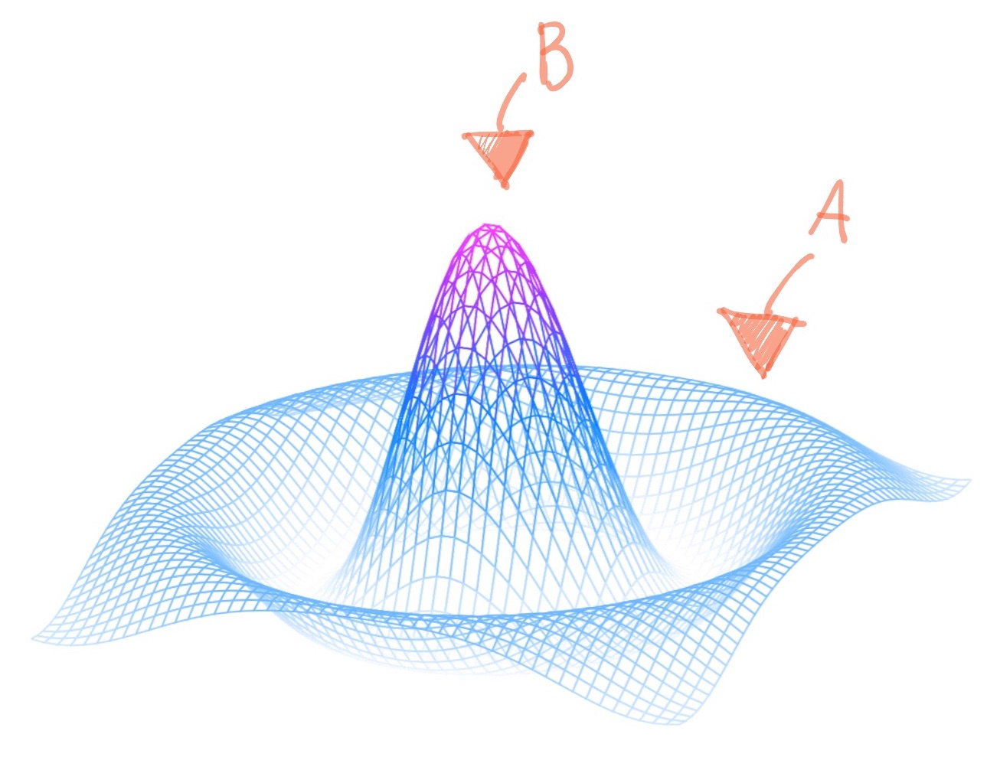

# About Me

I’m an independent software researcher & writer who explores new ways of doing things, while generally trying to find the best way of doing something, guided by some ineffable sense of elegance.

As a software researcher, while every idea must begin somewhere, I understand very well the **limits of forethought**. 

For instance consider the field of computability theory, it is well known that there are hard limits on what one can ‘know’ upfront from static information. Especially in the context of formal verification, where given some Turing complete program description, there are many insights one may wish to know that are generally impossible to answer upfront without some degree of evaluation. But while this is in the context of automation and its limits, such problems are **equally relevant to the limits of forethought** because ultimately the human brain is itself a computer and so is itself bound by the limits of computation.

> Nowadays while some programmers are trying to put all other programmers outta a job, some mathematicians have been trying to put all other mathematicians outta a job for at least a century.

This is the value I bring to the table, and is why my research style is very ‘evaluative’ and in an ‘exploratory’ manner. If you’re looking for those game-changer insights that cannot be known upfront (such as those concerning a business model), then I will come in and *compute* the problem to completion, and then report back on what has been uncovered along with any speculative advisory foresights from a refined context.

Also, as every Haskell zealot knows all too well when it comes to research: **avoid success at all costs!** Or in other words don't chase success. (Although this remark may also just be cope in the Haskell community.)

**Note:** **with regard to source code ownership rights, such can be negotiated.**

> I usually standardize on rust because it’s the lowest common denominator solution in a multitude of respects, for instance I can compile (and even cross-compile depending on my dependencies) rust code for a multitude of platforms, along with great community support for a multitude of use cases. In general, rust isn’t perfect but it **just works** in numerous respects (especially for data modeling and serialization which is often overlooked). Unless there’s a strong justification elsewhere, such as if I’m doing native iOS/macOS UI work for which idiomatic Swift is preferred throughout unless there’s a strong justification for rust with regard to app logic functionality (such as to support cross-platform app logic or if I just need to plug into some rust crate.)

Also, 

---

**Regarding my past research:**

I can’t do everything but what I can do I do well.

So far the highlight of my research (in order of coolness) has probably been:
1. Publishing hand drawn notes as self contained webpages in a resolution independent manner (why this is particularly cool is because it’s a fully freeform environment as webpages, also the editor includes some brilliant ideas for—among other things—dark mode support that no other note taking app does for some reason).
2. My brute force image compression optimizer (long story)
3. My native (iOS/macOS)  markdown renderer that supports all GitHub Flavored Markdown block types with full text-selection support (with multi-cursor support) in terms of TextKit 2 APIs which overall is probably one of the more practical components I’ve worked on (every single iOS app with a chatbot feature needs this).
4. I also once made an indentation based shell scripting language with some much needed improvements that all unix systems need (although this is probably the least loved of all my projects for some reason.) 
5. Regarding more abstract problems in computer science, I’ve designed and implemented a very nifty monadic parser combinator library in Swift. The monadic design here is just so elegant because it propagates the parser state between function calls without having to explicitly pass such around. Which just works so simply, and for that I think it’s beautiful. 

> Also someone needs to make a markdown based spreadsheet app using my native markdown rendering engine because such just seems superior to preexisting options in literally every conceivable manner possible including in terms of a native UI that just “feels right” and iOS users in particular (gotta love them ❤️) have been know to be super picky when it comes to text functionality (just ask the Flutter team.)
>
> Contact me if you need someone to figure out how to freakin implement horizontally scrollable text layout fragments which I’d love to solve once and for all. 

**In general:**

As a programmer who doesn’t use LLMs I don’t subscribe to any chatbot because everything I do is just too custom. Nowadays we forget that automation only applies to the most common of use cases, which for me is usually within the free tier. 

---

Honestly as a high octane thinker if I had kids I wouldn’t even want them to use LLMs unless I wanted to raise those with mentally inert mindsets that can only think in terms of corporate speak. 

If anything I’d love to explore anti-AI themed startup opportunities one day because it’d just be super ironic if such succeeded where all those success chasing startups failed. 

# Files

- **[PROJECTS.md](PROJECTS.md):** A mega overview of all my major projects. The culmination of my life.
- **[STATUS-LOG.md]( STATUS-LOG.md ):** my general timeline of activities.
- **[VERY-PERSONAL-BIO.md]( STATUS-LOG.md ):** A more personal pre-2025 biographical status timeline (incomplete).
- **[COMMUNITY-BUILDING.md]( COMMUNITY-BUILDING.md ):** random notes on something...
  
  I sometimes wonder if the *next big thing* as they say will turn out to be some form of social entrepreneurship… I’ve been looking for historical examples of primitive social entrepreneurship. The notes thereto is one such example.
  
  **Last Updated:** 2025-2-12
- **[QUOTES.md]( QUOTES.md ):** thought providing quotes on systems.
- **[surviving-where-others-fail.md](surviving-where-others-fail.md)**: Surviving where others fail by following the way. Something I wish I knew when I was younger. Perhaps it’ll save you one day. 

# Secret Ongoing Essays

**In general these are not yet reading for public consumption.**

- [The far-future of AI]( https://gist.github.com/colbyn/6aeeeecd1b321db179c7253c6437b356 ): discusses a future for AI that itself evolves with the progression of time.
  
  This is a short rough draft that contains many points, all of which I’d like to enumerate on in a series of articles sometime in the future.

  **IMO this is a true model for a ‘brain’ that will be the interface between humans and all digital/analog information as it changes with the progression of time.** A true model for an assistant will be perpetually active, integrating the diverse array of signals from your data sources, into summary information available at your request, or actively engaging with you when conditions merit your attention.

  Some of my thoughts thereto are inspired by the book Time-Space, Spiking Neural Networks and Brain-Inspired Artificial Intelligence.
  > “Everything exists and evolves within time–space and time–space is within everything, from a molecule to the universe. Understanding the complex relationship between time and space has been one of the biggest scientific challenges of all time.”

  Which may be an understatement, this may be the greatest scientific challenge of all time and it’s developed will happen not be via the scientific method but through the ancient engineering method (that built Europe’s cathedrals at a time when the ‘why’ wasn’t understood) and so therefore a new generation of creative individuals are needed, trained to think in terms of problem solving heuristics. 

  Just as in computability theory we know there exist problems that are unsolvable, and for such problems we put on our creative hat and think in terms of imperfect heuristics that can at least work in narrow spaces, and through such a manner overcome problems that are otherwise mathematically impossible to solve.

# Links

## Dev Blogs

- [Medium]( https://medium.com/@colbyn )
- [SubStack]( https://colbynwadman.substack.com/ )

## Contact

- Email: hello@colbyn.com

# Clarifications

Apparently my notion of *discrete math* entails more than I had thought, notably topics I know nothing about. My introduction to such was from purely functional programming focused textbooks (i.e. what’s expressible in terms of a simple lambda calculus based model of computation) where this whole idea of numbers just weren’t a thing. I prefer a framework based on purely discrete symbols and structures and relations between such. Simple and easy (the way god intended if anything.)

# Random Note

As a software researcher, half the problem is choosing your constraints wisely. Ultimately, projects need hard constraints to succeed (and not just be another copycat.)

For instance i’ve been thinking about this problem. In a way I am serious about [redacted]. But how could this be done?

I don’t know why but I find this interesting. 

From historical precedence,

Haskell would not be what it is today without the hard and never before seen constraint of lazy evaluation. Just to emphasize the point, nowadays lazy evaluation is considered to be a design mistake, but it shaped all other aspects in such a way that made it was it is today and therefore it was a worthwhile design mistake. (Although nowadays I’d rather use PureScript if only tooling was better.)

More generally,

It is well known that harder problems yield more satisfactory results. 

From a software research perspective, projects need hard and technically challenging constraints to innovate and make something new. 

So,

Perhaps this could be the defining constraint that makes [redacted] what it is and not just another copycat. 

But,

Another problem of the software researcher concerns generality or specificity. For instance should ‘X’ be implemented ad-hoc or in a uniform manner? Typically greater uniformity is best and most elegant but requires more research to find the lowest common denominator approach. Although more practically, greater uniformity generally ensures support for things that don’t neatly fit into predefined categories.

Similarly concerning generality or specificity, is the question of parameterization or polymorphous systems. Such as a system that is agnostic to certain aspects that normally define such a system ad-hoc. How many systems out there can only work with a single implementation of something? Greater uniformly is generally most forward compatible as the landscape evolves and in turn as environmental perturbations change.

Likewise on a tangent, 

Greater uniformity facilitates greater diversity within a whole system, and after all in ecology is it well understood that diversity increases productivity and stability because species vary in their response to environmental fluctuations, ensuring that some will always maintain system function.

# Random Thought 

I whole heartedly believe that honesty is always best in any scenario, especially in politics. But here, politicians don’t understand that the solution space as represented below may entail a regression to arrive at a more optimal state.

No politician can change the nature of the system with better propaganda; if the people want change then the reality of going from point A to point B must be made clear to the public, such is the only sustainable way or otherwise the public will fee as though the movement is a scam. 

But reality is never so certain as the graph above, those on the left should pray that a solution is found by the other party, because what benefits may come of it are to their benefit as well (in numerous respects) while the risk of such endeavors is wholly assumed by the other side. It just makes sense. After all, clearly Americans care deeply about immigration and inflation and so if the right can figure this out then those on the left will be free to run on a more pure platform without concern for such issues. 

