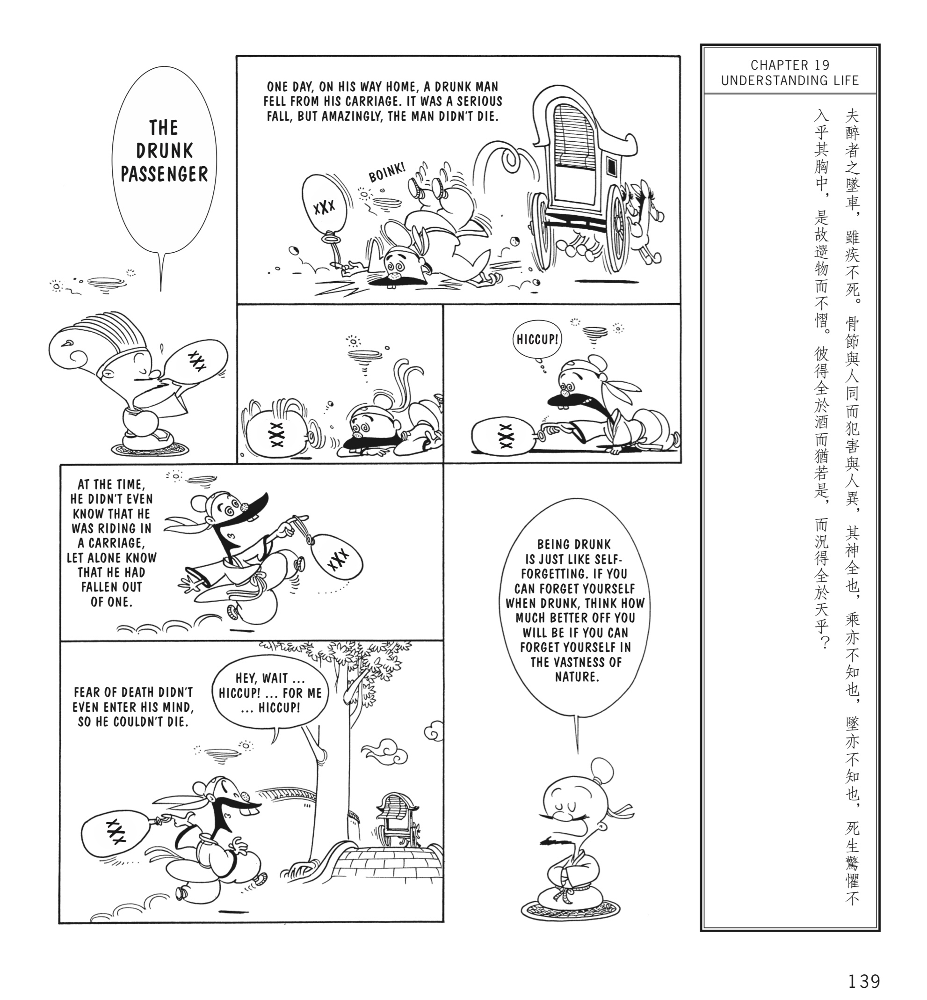

I bought my younger brother an illustrated version of the Zhuangzi for Christmas. I’ve been trying to get him to read more.

Personally, while it’s not the most profound thing in the whole book, for me this is the best parable therein:

I just find it interesting how in modern times you can have a head on collision with multiple fatalities and yet the inebriated driver usually walks away unscathed. 

While in mundane life simply reacting to life’s woes can significantly cascade bad luck. For this reason I argue that it’s best to be less conscious of life’s happenings as exemplified by the drunkard who is neither conscious of riding in the cart nor of falling out of it.

Concerning the cascading of bad luck, in The Following of Christ,

> “Each sin begetteth a special spiritual suffering. A suffering of this kind is like unto that of hell, for the more you suffer, the worse you become. This happeneth to sinners; the more they suffer through their sins, the more wicked they become; and they fall continually more and more into their sins in order to get free from their suffering.”

The sinner here is a very real story for me. In contrast the virtuous man is he who does not suffer from contact with objective existence, and so as the Zhuangzi parable ends in one such translation, “If such security is to be got from wine, how much more is it to be got from God?” (Translated here as God although I'm not certain that such is a good substitution for the Dao that represents that which stems from the more primal depths of the universe or so I had thought.)

Likewise in the Tao Te Ching there’s a saying,
> “Only those who do not cling to their life can save it.”

Perhaps one day you’ll suddenly find yourself moments before a head on collision with a drunk driver on the highway. In that moment will you yourself cling to life—or will you submit to fate and follow the way?
